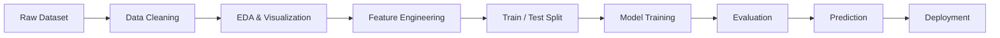

# 📊 Data Science & Machine Learning Portfolio

> **Turning raw data into insights, predictions, and intelligent solutions.**

A practical collection of my **Data Science, Data Analysis, Machine Learning, and AI projects** built with Python.

This repository documents my journey from **data preprocessing and EDA → machine learning → deep learning → model evaluation → deployment**.

---

## 🚀 What I Work With

<p align="center">


</p>

### Core Areas

`Python` · `Pandas` · `NumPy` · `EDA` · `Data Cleaning` · `Visualization`
`Feature Engineering` · `Regression` · `Classification` · `ANN / Deep Learning`
`Model Evaluation` · `Predictive Modeling` · `FastAPI` · `Streamlit`

---

# 🧠 My Data Science Workflow



**Data → Insight → Model → Prediction → Application**

---

# ⭐ Featured Projects

## 🏠 House Price Prediction

**Regression | Python | Scikit-learn | FastAPI**

Predict house prices using property-related features.

**Worked on:**

* Data preprocessing
* Exploratory Data Analysis
* Feature preparation
* Regression modeling
* Model evaluation
* Prediction API

**Focus:** Turning historical housing data into a predictive ML solution.

---

## 💳 Credit Card Fraud Detection

**Classification | Neural Networks | TensorFlow**

A fraud detection project focused on identifying potentially fraudulent transactions.

**Worked on:**

* Imbalanced dataset handling
* Data preprocessing
* Feature preparation
* Artificial Neural Network
* Accuracy / Precision / Recall
* ROC-AUC & PR-AUC
* Model evaluation

> Focused on the challenge of detecting rare fraudulent transactions rather than relying only on accuracy.

---

## ❤️ Heart Failure Prediction

**Classification | Scikit-learn**

Predict heart failure outcomes using patient-related features.

**Models explored:**

`Logistic Regression` · `Decision Tree` · `Random Forest`

**Skills demonstrated:**

* Data cleaning
* EDA
* Feature preparation
* Classification
* Confusion matrix
* Precision / Recall
* Model comparison

---

## 🫀 Framingham Heart Disease Prediction

**Classification | Machine Learning**

A predictive model based on the Framingham dataset to investigate cardiovascular risk.

**Workflow:**

`Data Cleaning → Feature Engineering → Model Training → Evaluation → Prediction`

Focus areas include:

* Missing-value handling
* Feature selection
* Classification
* Model comparison
* Evaluation metrics

---

## 🎓 Student Performance Prediction

**Regression | Python | Machine Learning**

Predict student performance using academic and relevant student features.

**Worked on:**

* Data preprocessing
* Feature selection
* Regression
* Prediction
* Model evaluation

---

## 📊 Business Data Analysis

**EDA | Pandas | Matplotlib | Seaborn**

Exploring business datasets to discover patterns and actionable insights.

### Analysis includes

* 📦 Product performance
* 👥 Customer behavior
* 💰 Sales patterns
* 📈 Trends
* 🔎 Data exploration
* 📊 Visual analytics

---

# 📈 Machine Learning Skills

### Regression

* Linear Regression
* Regression-based prediction
* House Price Prediction
* Student Performance Prediction
* MAE
* MSE
* RMSE
* R² Score

### Classification

* Logistic Regression
* Decision Tree
* Random Forest
* KNN
* SVM
* Gradient Boosting
* XGBoost / LightGBM
* Artificial Neural Networks

### Unsupervised Learning

* K-Means
* Customer Segmentation

### Data Preparation

* Missing-value handling
* Encoding
* Feature scaling
* Feature selection
* Feature transformation
* Train/Test splitting

---

# 📊 Model Evaluation

I don't rely on a single metric.

### Regression

```text
MAE ───── RMSE ───── MSE ───── R²
```

### Classification

```text
Accuracy ─ Precision ─ Recall ─ F1
                  │
                  ▼
            ROC-AUC / PR-AUC
```

For problems such as **fraud detection**, precision, recall, ROC-AUC and especially PR-AUC can provide more useful information than accuracy alone.

---

# 🔬 From Data Analysis to AI

```text
             DATA SCIENCE JOURNEY

        ┌──────────────────────┐
        │       Python         │
        └──────────┬───────────┘
                   ↓
        ┌──────────────────────┐
        │   Data Analysis      │
        │ Pandas + NumPy       │
        └──────────┬───────────┘
                   ↓
        ┌──────────────────────┐
        │ EDA & Visualization  │
        │ Matplotlib + Seaborn │
        └──────────┬───────────┘
                   ↓
        ┌──────────────────────┐
        │ Machine Learning     │
        │ Regression + Class.  │
        └──────────┬───────────┘
                   ↓
        ┌──────────────────────┐
        │ Deep Learning        │
        │ TensorFlow / ANN     │
        └──────────┬───────────┘
                   ↓
        ┌──────────────────────┐
        │ Model Deployment     │
        │ FastAPI / Streamlit  │
        └──────────┬───────────┘
                   ↓
              🚀 AI SYSTEMS
```

---

# 🛠️ Tech Stack

| Area                 | Technologies                    |
| -------------------- | ------------------------------- |
| **Language**         | Python                          |
| **Data Analysis**    | Pandas, NumPy                   |
| **Visualization**    | Matplotlib, Seaborn             |
| **Machine Learning** | Scikit-learn, XGBoost, LightGBM |
| **Deep Learning**    | TensorFlow, PyTorch             |
| **Deployment**       | FastAPI, Streamlit              |
| **Development**      | Jupyter Notebook, VS Code       |
| **Version Control**  | Git, GitHub                     |

---

# 📂 Repository Structure

```text
Data_Science/
│
├── 📁 Data_Analysis/
├── 📁 Machine_Learning/
├── 📁 Deep_Learning/
├── 📁 Datasets/
├── 📁 FastAPI/
├── 📁 Streamlit/
│
├── 🏠 House_Price_Prediction
├── 🎓 Student_Performance
├── ❤️ Heart_Failure
├── 🫀 Framingham
├── 💳 Fraud_Detection
│
└── README.md
```

---

# 🎯 What I'm Building Next

My next step is moving from **individual ML notebooks toward production-ready AI applications**.

### 🔥 Current learning direction

`Machine Learning`
→ `Deep Learning`
→ `NLP`
→ `Computer Vision`
→ `LLMs`
→ `FastAPI`
→ `AI Applications`
→ `MLOps`

Planned work includes:

* Advanced feature engineering
* Hyperparameter tuning
* Cross-validation
* Ensemble models
* Deep Learning
* NLP
* Computer Vision
* LLM applications
* REST APIs
* Streamlit dashboards
* Model deployment
* MLOps & monitoring

---

# 📊 Project Progress

| Area                | Progress   |
| ------------------- | ---------- |
| 🐍 Python           | ██████████ |
| 📊 Data Analysis    | █████████░ |
| 🤖 Machine Learning | ████████░░ |
| 🧠 Deep Learning    | ██████░░░░ |
| 🚀 Deployment       | █████░░░░░ |
| 🤖 AI / LLM         | ████░░░░░░ |

> **The goal isn't just to train models — it's to build useful systems around them.**

---

# 👨‍💻 About

I'm building practical experience across **Data Science, Machine Learning, Deep Learning, and AI**, with a focus on turning datasets into real-world predictive solutions.

I use this repository to document projects, experiments, lessons learned, and my progress toward becoming a stronger **Machine Learning / AI Engineer**.

### 🔗 Connect

**GitHub:** [Code-Creater1](https://github.com/Code-Creater1)

---

<p align="center">

### ⭐ If you find something useful here, consider giving the repository a star!

**Data → Intelligence → Impact 🚀**

</p>
